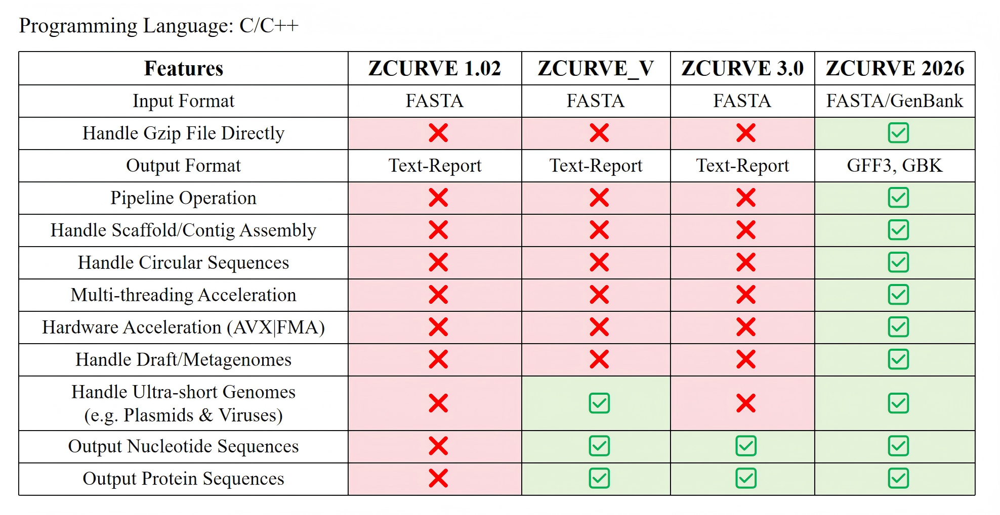

# ZCURVE 2026
A Prokaryotic Protein-coding Gene Recognition System Based On The Z-curve Theory


## Setup
### Windows/Linux (x86_64)
Download the latest precompiled binary file from the [release page](https://github.com/zetong-zhang/ZCURVE2026/releases), and decompress it to the directory of your choice.
### Other Operating Systems
Download and compile the source code yourself.

```bash
objcopy --input binary --output elf64-x86-64 --binary-architecture i386:x86-64 meta.bin meta.bin.o
g++ -DZLIB -o zcurve -fopenmp -mavx -mfma meta.bin.o Main.cpp BioIO.cpp BioUtil.cpp Encoding.cpp Model.cpp svm.cpp -static -lz -O3
```
*Note:*  
(1) If your system doesn't have zlib installed, or you just don't want to use zlib, just remove the `-DZLIB` and `-lz` option;   
(2) If you don't want to use AVX and FMA function, just remove the `-mavx` and `-mfma` option.

## Usage
### Quick Start
We recommend configure the environment variable `PATH` to include the directory of the executable binary file, such that you can run `zcurve` directly in the terminal.
```bash
zcurve -i example.fasta -o example.gff -c -f gff
```
### Options

`zcurve.exe [-h] [-q] [-T THREADS]`

#### General Options
* `-h, --help`  
Print help menu and exit. If no options are provided, the program will also print the help menu then exit.  

* `-q, --quiet`  
Run quietly with no stderr output.  

* `-T, --threads`  
Number of threads to use. Default to using all available CPUs.

#### Input/Output Options
* `-i, --input`   
Specify FASTA/Genbank input file. Read from standard input by default or if specified as '-'. Compressed files (*.gz) are also supported to be read directly.  

* `-o, --output`  
Specify output file. Write to standard output by default or if specified as '-'.

* `-f, --format`  
Select output format. GenBank (gbk) and GFF3 (gff) are supported. Output GFF3 by default.

* `-a, --faa`  
Write protein translations to the selected file.

* `-d, --fna`  
Write nucleotide sequences of genes to the selected file.

#### Gene-Finder Options  
* `-g, --table`  
Specify a translation table to use. Table 1 (Standard), 4 (Mycoplasma & Spiroplasma) and 11 (Bacteria & Archaea) are supported. Default to use table 11.

* `-l, --minlen`  
Specify the mininum length of open reading frames. 90 nt by default.  

* `-c, --circ`  
Treat topology as circular for all the input sequences.

* `-b, --bypass`  
Bypass semi-supervised SVM training. For extremely short genomic sequences, this option will be enabled forcibly. For sequences of mixed species, we recommend enabling this option, as the SVM is only suitable for training on a single genome.

* `-s, --thres`  
Specify putative gene score threshold. Default to 0.

